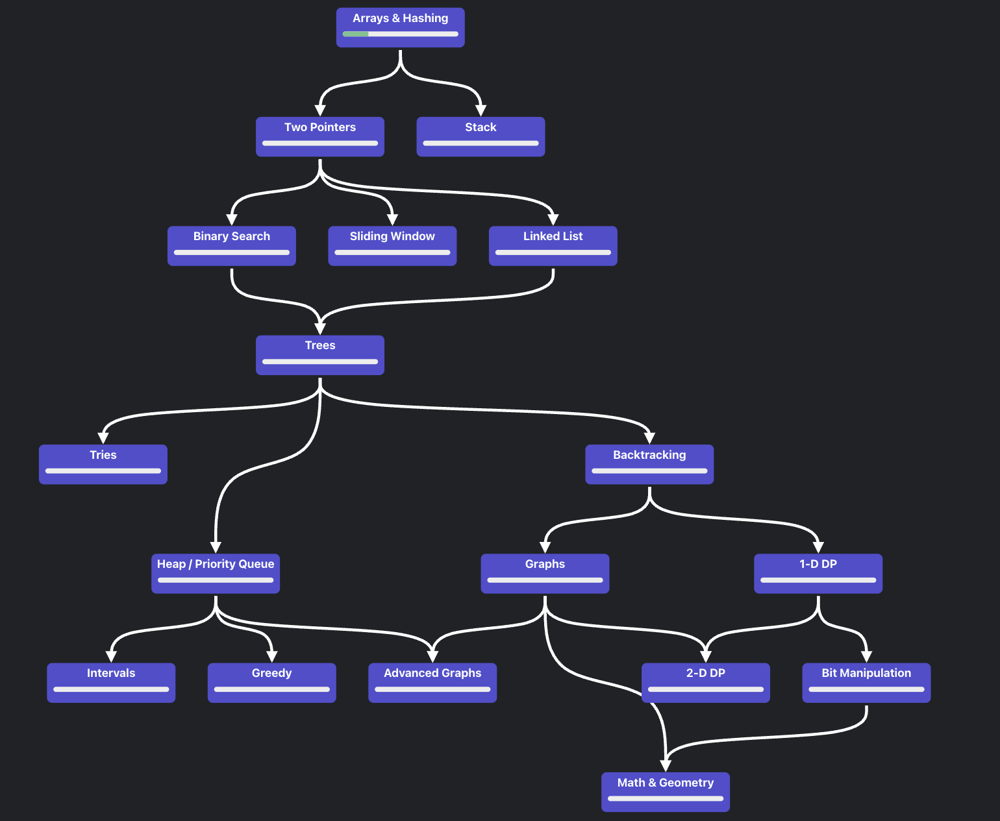

# Coding Interview Repository

## Introduction
This repository contains my solutions to coding interview challenges. It is intended to help you prepare for technical interviews and improve your programming skills.

## Project Structure
```
~/CodingInterview/neetcode
│
├── Topic1
│   └── // ...solution files...
├── Topic2
│   └── // ...solution files...
└── README.md  <!-- This file -->
```

## Roadmap
The projects are organized following this roadmap:



## License
This project is licensed under the MIT License.